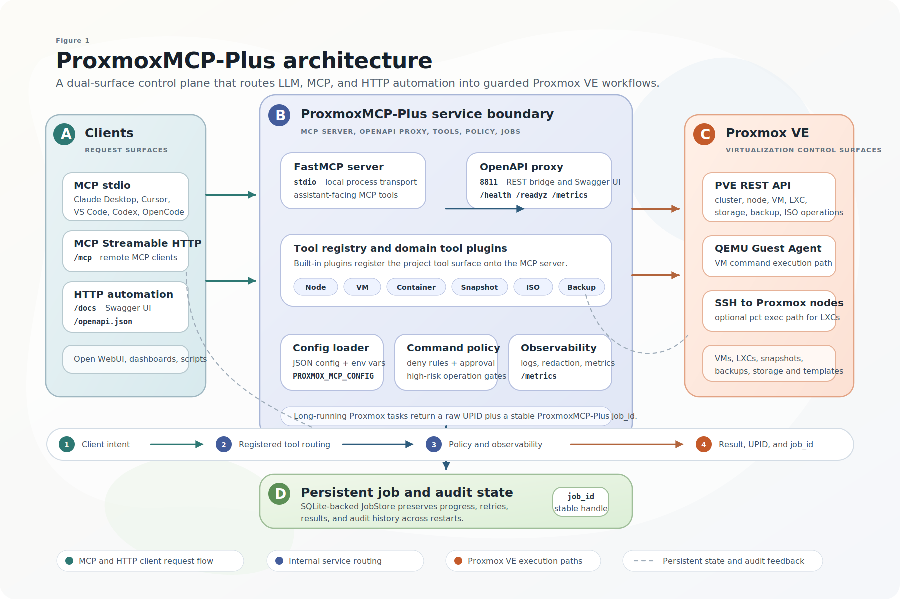

# ProxmoxMCP-Plus

<!-- mcp-name: io.github.RekklesNA/proxmox-mcp-plus -->

<div align="center">
  
</div>

<p align="center"><strong>Operate Proxmox VE from MCP clients, AI agents, and OpenAPI tooling through one security-conscious control plane for VMs, LXCs, snapshots, backups, ISOs, container commands, and persistent long-running jobs.</strong></p>

<p align="center">
  <a href="https://pypi.org/project/proxmox-mcp-plus/"></a>
  <a href="https://github.com/RekklesNA/ProxmoxMCP-Plus/releases"></a>
  <a href="https://github.com/RekklesNA/ProxmoxMCP-Plus/actions/workflows/ci.yml"></a>
  <a href="https://github.com/RekklesNA/ProxmoxMCP-Plus/pkgs/container/ProxmoxMCP-Plus"></a>
  <a href="LICENSE"></a>
</p>

<p align="center">
  <a href="#quick-start">Quick Start</a> |
  <a href="#client-install">Client Install</a> |
  <a href="#demo">Demo</a> |
  <a href="#choose-the-right-tool">Tools</a> |
  <a href="#safety-model">Safety</a> |
  <a href="#scenario-templates">Scenarios</a> |
  <a href="#documentation">Docs</a> |
  <a href="https://github.com/RekklesNA/ProxmoxMCP-Plus/wiki">Wiki</a>
</p>



## Why ProxmoxMCP-Plus

ProxmoxMCP-Plus sits between AI clients and Proxmox VE so operators do not have to stitch together raw API calls, one-off shell scripts, and custom job polling for every workflow.

It exposes the same operational surface in two ways:

- `MCP` for Claude Desktop, Cursor, VS Code, Open WebUI, Codex, and other MCP-capable agents
- `OpenAPI` for HTTP automation, dashboards, internal tools, and no-code workflows

What you get:

- VM and LXC lifecycle actions
- snapshot create, rollback, and delete
- backup and restore workflows
- ISO download and cleanup
- node, storage, and cluster inspection
- SSH-backed container command execution with guardrails
- persistent job tracking for async Proxmox tasks

## What Makes It Different

| Priority | How the project handles it |
| --- | --- |
| Dual access paths | Native MCP for agent workflows and OpenAPI for standard HTTP automation |
| Proxmox-oriented workflows | Day-2 VM, LXC, snapshot, backup, ISO, storage, and cluster operations |
| Long-running operations | Stable `job_id`s, Proxmox `UPID` tracking, polling, retry, cancel, and audit history |
| Safer execution | Proxmox API tokens, OpenAPI bearer auth, command policy, approval tokens, TLS validation, and MCP HTTP Host/Origin controls |
| Real validation | Unit, integration, Docker/OpenAPI, and live Proxmox e2e entry points are documented in the repo |

## Quick Start

### 1. Prepare Proxmox Credentials

Create a Proxmox API token with only the permissions your workflows need. Then create the local config file:

```bash
cp proxmox-config/config.example.json proxmox-config/config.json
```

Then edit `proxmox-config/config.json` with your environment. At minimum, it needs:

- `proxmox.host`
- `proxmox.port`
- `auth.user`
- `auth.token_name`
- `auth.token_value`

Add an `ssh` section as well if you want container command execution.
Add a `jobs` section if you want job state persisted somewhere other than the default local SQLite file.

For real live verification, use a separate `proxmox-config/config.live.json` created from `proxmox-config/config.live.example.json`.
Do not point live e2e at a placeholder or local-only `config.json` unless you intentionally run a local API tunnel there.

Optional job persistence config:

```json
{
  "jobs": {
    "sqlite_path": "proxmox-jobs.sqlite3"
  }
}
```

### 2. Choose One Runtime Path

| Path | Best for | Start command | Verify |
| --- | --- | --- | --- |
| MCP stdio from PyPI | Claude Desktop, Cursor, VS Code, Codex, local agents | `uvx proxmox-mcp-plus` | client lists `get_nodes`, `get_vms`, and job tools |
| Native MCP HTTP from Docker | remote MCP clients that support Streamable HTTP | `docker compose --profile mcp-http up -d proxmox-mcp-http` | connect to `http://localhost:8000/mcp` |
| OpenAPI bridge from Docker | HTTP clients, dashboards, scripts, no-code tools | `docker compose up -d` | `curl -f http://localhost:8811/livez` |

#### MCP stdio with PyPI

```bash
uvx proxmox-mcp-plus
```

Or install it first:

```bash
pip install proxmox-mcp-plus
proxmox-mcp-plus
```

Use this path when the MCP client launches a local stdio server.

#### Native MCP HTTP with Docker

Use this path when a remote MCP client supports Streamable HTTP:

```bash
docker run --rm -p 8000:8000 \
  -e PROXMOX_MCP_MODE=mcp-http \
  -e MCP_HOST=0.0.0.0 \
  -e MCP_PORT=8000 \
  -e MCP_TRANSPORT=STREAMABLE_HTTP \
  -v "$(pwd)/proxmox-config/config.json:/app/proxmox-config/config.json:ro" \
  ghcr.io/rekklesna/proxmoxmcp-plus:latest
```

Point MCP clients at:

```text
http://<docker-host>:8000/mcp
```

When serving MCP HTTP behind a reverse proxy, keep DNS rebinding protection enabled and allow only the hostnames you expect:

```bash
docker run --rm -p 8000:8000 \
  -e PROXMOX_MCP_MODE=mcp-http \
  -e MCP_HOST=0.0.0.0 \
  -e MCP_PORT=8000 \
  -e MCP_TRANSPORT=STREAMABLE_HTTP \
  -e MCP_DNS_REBINDING_PROTECTION=true \
  -e MCP_ALLOWED_HOSTS=mcp.example.com:*,localhost:* \
  -e MCP_ALLOWED_ORIGINS=https://mcp.example.com \
  -v "$(pwd)/proxmox-config/config.json:/app/proxmox-config/config.json:ro" \
  ghcr.io/rekklesna/proxmoxmcp-plus:latest
```

#### OpenAPI bridge with Docker

OpenAPI mode is the default Docker runtime and requires an API key:

```bash
export PROXMOX_API_KEY="$(openssl rand -hex 32)"
docker run --rm -p 8811:8811 \
  -e PROXMOX_API_KEY="$PROXMOX_API_KEY" \
  -v "$(pwd)/proxmox-config/config.json:/app/proxmox-config/config.json:ro" \
  ghcr.io/rekklesna/proxmoxmcp-plus:latest
```

Verify the OpenAPI surface:

```bash
curl -f http://localhost:8811/livez
curl -f -H "Authorization: Bearer $PROXMOX_API_KEY" http://localhost:8811/health
curl -H "Authorization: Bearer $PROXMOX_API_KEY" http://localhost:8811/openapi.json
```

For local unauthenticated development only, set `PROXMOX_ALLOW_NO_AUTH=true`.

#### Source checkout

```bash
git clone https://github.com/RekklesNA/ProxmoxMCP-Plus.git
cd ProxmoxMCP-Plus
uv venv
uv pip install -e ".[dev]"
python main.py
```

The `8811` service is the OpenAPI/REST bridge. The `8000` service is the native MCP HTTP endpoint.

## Client Install

Use the one-click buttons when your client supports MCP install deeplinks, or copy the JSON config below.

[](https://insiders.vscode.dev/redirect/mcp/install?name=proxmox-mcp-plus&inputs=%5B%7B%22id%22%3A%22proxmox_host%22%2C%22type%22%3A%22promptString%22%2C%22description%22%3A%22Proxmox%20host%22%7D%2C%7B%22id%22%3A%22proxmox_user%22%2C%22type%22%3A%22promptString%22%2C%22description%22%3A%22Proxmox%20user%2C%20for%20example%20root%40pam%22%7D%2C%7B%22id%22%3A%22proxmox_token_name%22%2C%22type%22%3A%22promptString%22%2C%22description%22%3A%22Proxmox%20API%20token%20name%22%7D%2C%7B%22id%22%3A%22proxmox_token_value%22%2C%22type%22%3A%22promptString%22%2C%22description%22%3A%22Proxmox%20API%20token%20value%22%2C%22password%22%3Atrue%7D%5D&config=%7B%22command%22%3A%22uvx%22%2C%22args%22%3A%5B%22proxmox-mcp-plus%22%5D%2C%22env%22%3A%7B%22PROXMOX_HOST%22%3A%22%24%7Binput%3Aproxmox_host%7D%22%2C%22PROXMOX_USER%22%3A%22%24%7Binput%3Aproxmox_user%7D%22%2C%22PROXMOX_TOKEN_NAME%22%3A%22%24%7Binput%3Aproxmox_token_name%7D%22%2C%22PROXMOX_TOKEN_VALUE%22%3A%22%24%7Binput%3Aproxmox_token_value%7D%22%2C%22PROXMOX_VERIFY_SSL%22%3A%22true%22%7D%7D)
[](https://cursor.com/en/install-mcp?name=proxmox-mcp-plus&config=eyJjb21tYW5kIjoidXZ4IHByb3htb3gtbWNwLXBsdXMiLCJlbnYiOnsiUFJPWE1PWF9IT1NUIjoieW91ci1wcm94bW94LWhvc3QiLCJQUk9YTU9YX1VTRVIiOiJyb290QHBhbSIsIlBST1hNT1hfVE9LRU5fTkFNRSI6Im1jcC10b2tlbiIsIlBST1hNT1hfVE9LRU5fVkFMVUUiOiJ5b3VyLXRva2VuLXNlY3JldCIsIlBST1hNT1hfVkVSSUZZX1NTTCI6InRydWUifX0=)

Recommended stdio config:

```json
{
  "mcpServers": {
    "proxmox-mcp-plus": {
      "command": "uvx",
      "args": ["proxmox-mcp-plus"],
      "env": {
        "PROXMOX_HOST": "your-proxmox-host",
        "PROXMOX_USER": "root@pam",
        "PROXMOX_TOKEN_NAME": "mcp-token",
        "PROXMOX_TOKEN_VALUE": "your-token-secret",
        "PROXMOX_PORT": "8006",
        "PROXMOX_VERIFY_SSL": "true"
      }
    }
  }
}
```

Use a local config file if you prefer not to keep credentials in the client config:

```json
{
  "mcpServers": {
    "proxmox-mcp-plus": {
      "command": "uvx",
      "args": ["proxmox-mcp-plus"],
      "env": {
        "PROXMOX_MCP_CONFIG": "/path/to/ProxmoxMCP-Plus/proxmox-config/config.json"
      }
    }
  }
}
```

Client-specific examples for Claude Desktop, Cursor, VS Code, Codex, OpenCode, Open WebUI, Streamable HTTP, and OpenAPI are in the [Client Setup Guide](docs/wiki/Client%20Setup.md) and [Integrations Guide](docs/wiki/Integrations%20Guide.md).

## Demo

This demo is a direct terminal recording of `qwen/qwen3.6-plus` driving a live MCP session in English against a local Proxmox lab. It shows natural-language control flowing through MCP tools to create and start an LXC, execute a container command, and confirm the authenticated HTTP `/health` surface.


[Watch the MP4 version](docs/assets/proxmoxmcp-demo.mp4)

## Choose The Right Tool

Start with read-only discovery, then move to mutating tools only after the target node, storage, VMID, and permissions are clear.

| Operator goal | Start with | Then use | Notes |
| --- | --- | --- | --- |
| Inspect the cluster | `get_nodes`, `get_cluster_status` | `get_storage`, `get_vms`, `get_containers` | Best first health check after client install |
| Create or manage a VM | `get_nodes`, `get_storage` | `create_vm`, `start_vm`, `stop_vm`, `delete_vm` | Long-running mutations return `job_id` and Proxmox `task_id` |
| Manage LXCs | `get_containers`, `get_storage` | `create_container`, `start_container`, `stop_container`, `delete_container` | SSH-backed command tools require the optional `ssh` config |
| Roll back risky changes | `list_snapshots` with `vm_type=qemu` or `vm_type=lxc` | `create_snapshot`, `rollback_snapshot`, `delete_snapshot` | Create a snapshot before destructive workflow tests |
| Run commands inside guests | VM or container status tools | `execute_vm_command`, `execute_container_command` | VM path needs QEMU Guest Agent; LXC path needs SSH to the Proxmox node |
| Track async work | mutation response with `job_id` | `poll_job`, `get_job`, `list_jobs`, `retry_job`, `cancel_job` | Use `job_id` for agent/user conversations and `task_id` for raw Proxmox traceability |
| Automate from HTTP tools | `/openapi.json` | `/jobs`, `/health`, generated tool routes | Use bearer auth and keep CORS restricted outside local development |

For the full tool map, see the [Tool Selection Guide](docs/wiki/Tool%20Selection%20Guide.md) and [API & Tool Reference](docs/wiki/API%20%26%20Tool%20Reference.md).

## Safety Model

ProxmoxMCP-Plus is an access layer, not a replacement for Proxmox RBAC, network controls, or client-side MCP approval prompts.

The project gives operators several control points:

- Proxmox API tokens decide what the backend can do.
- `PROXMOX_API_KEY` protects the OpenAPI bridge by default.
- TLS verification is enforced unless development mode is explicitly enabled.
- `command_policy` controls command execution and high-risk operations.
- `approval_token` can gate command execution and high-risk mutating actions.
- MCP Streamable HTTP deployments can use DNS rebinding protection plus Host and Origin allowlists.
- Logs are designed to avoid exposing command and credential material.

Read the [Security Guide](docs/wiki/Security%20Guide.md) before exposing the server outside a trusted local environment.

## Core Platform Capabilities

ProxmoxMCP-Plus provides a unified control surface for the operational tasks most teams actually need in Proxmox VE. The same server can expose these workflows to MCP clients for LLM and AI-agent use cases, and to HTTP consumers through the OpenAPI bridge.

Supported workflow areas:

| Capability Area | Availability |
| --- | --- |
| VM create / start / stop / delete | Available |
| VM snapshot create / rollback / delete | Available |
| Backup create / restore | Available |
| ISO download / delete | Available |
| LXC create / start / stop / delete | Available |
| Container SSH-backed command execution | Available |
| Container authorized_keys update | Available |
| Persistent job store for long tasks | Available |
| MCP job control tools (`list_jobs`, `get_job`, `poll_job`, `cancel_job`, `retry_job`) | Available |
| OpenAPI `/jobs` endpoints with explicit status codes | Available |
| Local OpenAPI `/livez`, `/readyz`, `/health`, and schema | Available |
| Docker native MCP Streamable HTTP at `/mcp` | Available |
| Docker image build and `/livez` | Available |

Validation and contract entry points in this repository:

- `pytest -q --cov=proxmox_mcp --cov-report=term-missing --cov-fail-under=75`
- `ruff check .`
- `mypy src --ignore-missing-imports`
- `pip-audit -r requirements.txt`
- `tests/integration/test_real_contract.py`
- `tests/scripts/run_real_e2e.py`

`tests/scripts/run_real_e2e.py` now prefers `proxmox-config/config.live.json` or `PROXMOX_MCP_E2E_CONFIG`.
This avoids accidentally running live checks against a machine-specific default `config.json`.

## Long-Running Jobs

Many Proxmox mutations are asynchronous. ProxmoxMCP-Plus now wraps those tasks in a persistent job layer so MCP and OpenAPI clients can track them through a stable `Job ID`.

Long-running tools such as VM create/start/stop, container create/start/stop, snapshot changes, backup/restore, and ISO download/delete now return both:

- `task_id`: the raw Proxmox `UPID`
- `job_id`: the stable server-side job record

The job record stores:

- current status and progress
- retry count and prior `UPID`s
- latest result payload or failure reason
- audit history for create, poll, retry, and cancel actions

By default the job store persists to `proxmox-jobs.sqlite3`, so restart does not lose in-flight or completed job metadata.

### MCP Job Tools

- `list_jobs`
- `get_job`
- `poll_job`
- `cancel_job`
- `retry_job`

### OpenAPI Job Routes

When the OpenAPI proxy is enabled and a local `JobStore` is available, these routes are exposed directly:

| Path | Method | Purpose | Success Codes |
| --- | --- | --- | --- |
| `/jobs` | `GET` | list persisted jobs | `200` |
| `/jobs/{job_id}` | `GET` | fetch one job, optional `refresh=true` | `200` |
| `/jobs/{job_id}/poll` | `POST` | refresh status from Proxmox | `200` |
| `/jobs/{job_id}/cancel` | `POST` | request cancellation | `202` |
| `/jobs/{job_id}/retry` | `POST` | replay a stored retry recipe | `202` |

Common error codes:

- `404`: unknown `job_id`
- `409`: the job exists but that operation is not valid now
- `503`: the OpenAPI proxy was started without a local `JobStore`

`tests/scripts/run_real_e2e.py` now prefers `proxmox-config/config.live.json` or `PROXMOX_MCP_E2E_CONFIG`.
This avoids accidentally running live checks against a machine-specific default `config.json`.

## Positioning Against Common Approaches

| Capability | Official Proxmox API | One-off scripts | ProxmoxMCP-Plus |
| --- | --- | --- | --- |
| MCP for LLM and AI agent workflows | No | No | Yes |
| OpenAPI surface for standard HTTP tooling | No | Usually no | Yes |
| VM and LXC operations in one interface | Low-level only | Depends | Yes |
| Snapshot, backup, and restore workflows | Low-level only | Depends | Yes |
| Persistent async job tracking and retry | No | Rare | Yes |
| Container command execution with policy controls | No | Custom only | Yes |
| Docker distribution path | No | Rare | Yes |
| Repository-level live-environment verification | N/A | Rare | Yes |

## Scenario Templates

Ready-to-copy examples live in [`docs/examples/`](docs/examples/README.md):

- [Create a test VM](docs/examples/create-test-vm.md)
- [Roll back a risky change with snapshots](docs/examples/rollback-snapshot.md)
- [Download an ISO and create an LXC](docs/examples/download-iso-and-create-lxc.md)

These are written for both human operators and LLM-driven usage.

## Documentation

The README is intentionally optimized for fast GitHub comprehension. Longer operational docs live in `docs/wiki/` and can also be published to the GitHub Wiki.

| If you need to... | Start here |
| --- | --- |
| Understand the project and deployment flow | [Wiki Home](docs/wiki/Home.md) |
| Configure and run against a Proxmox environment | [Operator Guide](docs/wiki/Operator%20Guide.md) |
| Connect Claude Desktop, Cursor, VS Code, Codex, Open WebUI, or HTTP clients | [Client Setup Guide](docs/wiki/Client%20Setup.md) |
| Choose the right tool for a workflow | [Tool Selection Guide](docs/wiki/Tool%20Selection%20Guide.md) |
| Review docs quality goals, media plan, and publishing checklist | [Documentation Quality Plan](docs/wiki/Documentation%20Quality%20Plan.md) |
| Review integration patterns and transport details | [Integrations Guide](docs/wiki/Integrations%20Guide.md) |
| Install from MCP-aware IDEs and agents | [Agent Installation](docs/agent-installation.md) |
| Enable LXC command execution over SSH | [Container Command Execution](docs/container-command-execution.md) |
| Review security and command policy | [Security Guide](docs/wiki/Security%20Guide.md) |
| Inspect tool parameters, prerequisites, and behavior | [API & Tool Reference](docs/wiki/API%20%26%20Tool%20Reference.md) |
| Debug startup, auth, or health issues | [Troubleshooting](docs/wiki/Troubleshooting.md) |
| Work on the codebase or release it | [Developer Guide](docs/wiki/Developer%20Guide.md) |
| Review release and upgrade notes | [Release & Upgrade Notes](docs/wiki/Release%20%26%20Upgrade%20Notes.md) |

Published wiki:

- [GitHub Wiki Home](https://github.com/RekklesNA/ProxmoxMCP-Plus/wiki/Home)

## Repo Layout

- `src/proxmox_mcp/`: MCP server, config loading, security, OpenAPI bridge
- `main.py`: MCP entrypoint for local and client-driven usage
- `docker-compose.yml`: HTTP/OpenAPI runtime
- `requirements/`: auxiliary dependency sources and runtime install lists
- `scripts/`: helper startup scripts for local workflows
- `tests/scripts/run_real_e2e.py`: live Proxmox and Docker/OpenAPI path
- `tests/`: unit and integration coverage
- `docs/examples/`: scenario-driven prompts and HTTP examples
- `docs/wiki/`: longer-form operator, integration, and reference docs

## Development Checks

```bash
pytest -q --cov=proxmox_mcp --cov-report=term-missing --cov-fail-under=75
ruff check .
mypy src --ignore-missing-imports
pip-audit -r requirements.txt
python -m build
```

Paramiko 5.0.0 or newer is required so `pip-audit` can run without a `CVE-2026-44405` exception.

## License

[MIT](LICENSE)
